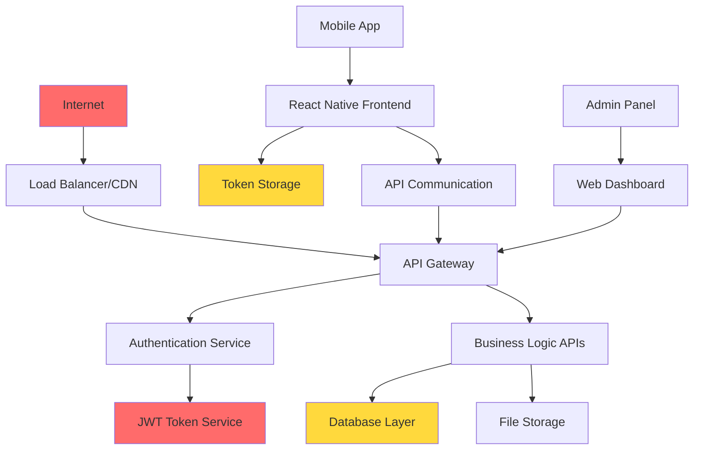

# 🎯 Threat Model & Security Mitigation Matrix

## SkillSwap Platform Security Analysis

---

## 🚨 Executive Summary

**Current Security Posture:** MODERATE RISK  
**Critical Vulnerabilities Found:** 8  
**Immediate Action Required:** YES  
**OWASP Top 10 Compliance:** 40% (4/10 fully addressed)

### Quick Risk Assessment

| **Risk Category** | **Current Status** | **Business Impact** | **Mitigation Priority** |
|-------------------|-------------------|-------------------|----------------------|
| Authentication Bypass | 🔴 HIGH | Revenue Loss, Data Breach | CRITICAL |
| Data Exfiltration | 🔴 HIGH | GDPR Fines, Reputation | CRITICAL |
| Service Disruption | 🟡 MEDIUM | User Churn, Revenue | HIGH |
| Privacy Violations | 🟡 MEDIUM | Legal Compliance | HIGH |

---

## 🎯 Threat Model Analysis

### Attack Surface Mapping



### Critical Attack Vectors

#### 1. 🔓 Authentication & Session Management

**Threat:** JWT Token Compromise
- **Attack Vector:** Weak secret key allows token forgery
- **Probability:** HIGH (public defaults in code)
- **Impact:** CRITICAL (full account takeover)
- **Current Exposure:** JWT secret `skillswap-secret-key-that-should-be-changed-in-production`

**Threat:** Session Hijacking
- **Attack Vector:** Long-lived tokens (24h) increase window
- **Probability:** MEDIUM
- **Impact:** HIGH (unauthorized access)
- **Current Exposure:** No token rotation, no blacklisting

**Threat:** Brute Force Attacks
- **Attack Vector:** No rate limiting on `/auth/login`
- **Probability:** HIGH (easily automated)
- **Impact:** MEDIUM (account lockout, credential stuffing)
- **Current Exposure:** Unlimited login attempts

#### 2. 🌐 Cross-Origin & Network Security

**Threat:** CORS Misconfiguration Attack
- **Attack Vector:** `@CrossOrigin(origins = "*")` allows any domain
- **Probability:** HIGH (any website can make requests)
- **Impact:** HIGH (CSRF, data theft)
- **Current Exposure:** All API endpoints accessible from any origin

**Threat:** Man-in-the-Middle
- **Attack Vector:** No HTTPS enforcement
- **Probability:** MEDIUM (public WiFi, proxies)
- **Impact:** CRITICAL (credential interception)
- **Current Exposure:** HTTP-only development configuration

#### 3. 💉 Injection & Input Validation

**Threat:** XSS Injection
- **Attack Vector:** Insufficient input sanitization
- **Probability:** MEDIUM (user-generated content)
- **Impact:** MEDIUM (credential theft, session hijacking)
- **Current Exposure:** Basic validation, no HTML sanitization

**Threat:** SQL Injection
- **Attack Vector:** Dynamic query construction
- **Probability:** LOW (JPA/Hibernate protection)
- **Impact:** CRITICAL (database compromise)
- **Current Exposure:** Spring Data JPA mitigates but custom queries exist

#### 4. 📱 Mobile App Security

**Threat:** Token Storage Compromise
- **Attack Vector:** Insecure local storage
- **Probability:** MEDIUM (device compromise, malware)
- **Impact:** HIGH (persistent access)
- **Current Exposure:** Unknown - frontend code not accessible

**Threat:** Certificate Pinning Bypass
- **Attack Vector:** Missing SSL pinning
- **Probability:** MEDIUM (proxy tools)
- **Impact:** HIGH (API interception)
- **Current Exposure:** No certificate pinning implementation visible

---

## 🛡️ Detailed Mitigation Strategies

### 🔥 CRITICAL (Fix within 24-48 hours)

#### 1. JWT Security Hardening

**Current Implementation:**
```java
@Value("${app.jwt.secret:skillswap-secret-key-that-should-be-changed-in-production}")
private String jwtSecret;

@Value("${app.jwt.expiration:86400000}") // 24 hours
private Long jwtExpirationInMs;
```

**Secure Implementation:**
```java
@Configuration
public class JwtSecurityConfig {
    
    @Value("${JWT_SECRET}")
    private String jwtSecret; // Required 256-bit key from environment
    
    @Value("${JWT_ACCESS_EXPIRATION:900000}") // 15 minutes
    private Long accessTokenExpiration;
    
    @Value("${JWT_REFRESH_EXPIRATION:604800000}") // 7 days
    private Long refreshTokenExpiration;
    
    @PostConstruct
    public void validateConfiguration() {
        if (jwtSecret == null || jwtSecret.length() < 32) {
            throw new IllegalStateException("JWT_SECRET must be at least 256 bits");
        }
    }
    
    @Bean
    public SecretKeySpec jwtSigningKey() {
        return new SecretKeySpec(
            Base64.getDecoder().decode(jwtSecret),
            SignatureAlgorithm.HS256.getJcaName()
        );
    }
}

// Token Blacklist Service
@Service
public class TokenBlacklistService {
    
    @Autowired
    private RedisTemplate<String, Object> redisTemplate;
    
    public void blacklistToken(String token) {
        String jti = extractJti(token);
        long remainingTime = getRemainingTokenTime(token);
        
        redisTemplate.opsForValue().set(
            "blacklist:" + jti,
            true,
            Duration.ofMillis(remainingTime)
        );
    }
    
    public boolean isTokenBlacklisted(String token) {
        String jti = extractJti(token);
        return Boolean.TRUE.equals(
            redisTemplate.opsForValue().get("blacklist:" + jti)
        );
    }
}

// Enhanced JWT Filter
@Override
protected void doFilterInternal(HttpServletRequest request, 
                               HttpServletResponse response, 
                               FilterChain filterChain) throws ServletException, IOException {
    
    String token = getTokenFromRequest(request);
    
    if (token != null && jwtUtils.validateToken(token) && 
        !tokenBlacklistService.isTokenBlacklisted(token)) {
        
        // Check for token reuse (multiple concurrent sessions)
        if (tokenReuseDetection.isTokenReused(token, request.getRemoteAddr())) {
            // Blacklist token and force re-auth
            tokenBlacklistService.blacklistToken(token);
            response.setStatus(HttpStatus.UNAUTHORIZED.value());
            return;
        }
        
        UsernamePasswordAuthenticationToken authentication = 
            getAuthentication(token);
        SecurityContextHolder.getContext().setAuthentication(authentication);
    }
    
    filterChain.doFilter(request, response);
}
```

#### 2. CORS Security Configuration

**Current Vulnerable Configuration:**
```java
@CrossOrigin(origins = "*", maxAge = 3600)
public class AuthController {
    // VULNERABLE: Allows any origin
}
```

**Secure Configuration:**
```java
@Configuration
@EnableWebSecurity
public class SecurityConfig {
    
    @Bean
    public CorsConfigurationSource corsConfigurationSource() {
        CorsConfiguration configuration = new CorsConfiguration();
        
        // Specific allowed origins (no wildcards)
        configuration.setAllowedOrigins(Arrays.asList(
            "https://skillswap.app",
            "https://api.skillswap.app",
            "https://admin.skillswap.app"
        ));
        
        configuration.setAllowedMethods(Arrays.asList(
            "GET", "POST", "PUT", "DELETE", "OPTIONS"
        ));
        
        configuration.setAllowedHeaders(Arrays.asList(
            "Authorization", "Content-Type", "X-Requested-With"
        ));
        
        configuration.setAllowCredentials(true);
        configuration.setMaxAge(3600L);
        
        UrlBasedCorsConfigurationSource source = new UrlBasedCorsConfigurationSource();
        source.registerCorsConfiguration("/api/**", configuration);
        
        return source;
    }
    
    @Bean
    public SecurityFilterChain filterChain(HttpSecurity http) throws Exception {
        return http
            .cors(cors -> cors.configurationSource(corsConfigurationSource()))
            .csrf(csrf -> csrf.disable()) // Use CSRF tokens in production
            .authorizeHttpRequests(auth -> auth
                .requestMatchers("/api/auth/login", "/api/auth/register").permitAll()
                .requestMatchers("/api/admin/**").hasRole("ADMIN")
                .anyRequest().authenticated()
            )
            .sessionManagement(session -> 
                session.sessionCreationPolicy(SessionCreationPolicy.STATELESS)
            )
            .addFilterBefore(jwtAuthenticationFilter(), 
                           UsernamePasswordAuthenticationFilter.class)
            .build();
    }
}

// Remove @CrossOrigin annotations from all controllers
@RestController
@RequestMapping("/api/auth")
// @CrossOrigin(origins = "*", maxAge = 3600) // REMOVE THIS
public class AuthController {
    // Controller logic without CORS annotations
}
```

#### 3. Rate Limiting Implementation

**Implementation with Bucket4j + Redis:**
```java
@Configuration
public class RateLimitConfig {
    
    @Bean
    public ProxyManager<String> proxyManager(LettuceConnectionFactory connectionFactory) {
        return Bucket4j.extension(RedisLettuceExtension.class)
            .proxyManagerForMap(connectionFactory);
    }
}

@Component
public class RateLimitingService {
    
    private final ProxyManager<String> proxyManager;
    
    public RateLimitingService(ProxyManager<String> proxyManager) {
        this.proxyManager = proxyManager;
    }
    
    public boolean tryConsume(String key, BucketConfiguration config) {
        Bucket bucket = proxyManager.builder()
            .build(key, config);
        return bucket.tryConsume(1);
    }
    
    public BucketConfiguration getAuthBucketConfig() {
        // 5 attempts per minute for auth endpoints
        return BucketConfiguration.builder()
            .addLimit(
                Bandwidth.classic(5, Refill.intervally(5, Duration.ofMinutes(1)))
                    .withInitialTokens(5)
            )
            .build();
    }
    
    public BucketConfiguration getApiBucketConfig() {
        // 100 requests per minute for API endpoints
        return BucketConfiguration.builder()
            .addLimit(
                Bandwidth.classic(100, Refill.intervally(100, Duration.ofMinutes(1)))
                    .withInitialTokens(100)
            )
            .build();
    }
}

@Component
@Order(Ordered.HIGHEST_PRECEDENCE)
public class RateLimitingFilter implements Filter {
    
    @Autowired
    private RateLimitingService rateLimitingService;
    
    @Override
    public void doFilter(ServletRequest request, ServletResponse response, 
                        FilterChain chain) throws IOException, ServletException {
        
        HttpServletRequest httpRequest = (HttpServletRequest) request;
        HttpServletResponse httpResponse = (HttpServletResponse) response;
        
        String clientIp = getClientIp(httpRequest);
        String endpoint = httpRequest.getRequestURI();
        
        // Rate limit key: IP + endpoint
        String rateLimitKey = clientIp + ":" + normalizeEndpoint(endpoint);
        
        BucketConfiguration config = getBucketConfig(endpoint);
        
        if (!rateLimitingService.tryConsume(rateLimitKey, config)) {
            httpResponse.setStatus(HttpStatus.TOO_MANY_REQUESTS.value());
            httpResponse.setContentType("application/json");
            httpResponse.getWriter().write(
                "{\"error\":\"Rate limit exceeded\",\"retryAfter\":60}"
            );
            return;
        }
        
        chain.doFilter(request, response);
    }
    
    private BucketConfiguration getBucketConfig(String endpoint) {
        if (endpoint.contains("/auth/")) {
            return rateLimitingService.getAuthBucketConfig();
        }
        return rateLimitingService.getApiBucketConfig();
    }
    
    private String getClientIp(HttpServletRequest request) {
        String xForwardedFor = request.getHeader("X-Forwarded-For");
        if (xForwardedFor != null && !xForwardedFor.isEmpty()) {
            return xForwardedFor.split(",")[0].trim();
        }
        return request.getRemoteAddr();
    }
}
```

### 🟡 HIGH PRIORITY (Fix within 1 week)

#### 4. Input Validation & Sanitization

**Enhanced Validation Framework:**
```java
@Component
public class InputSanitizer {
    
    private final PolicyFactory htmlSanitizer;
    
    public InputSanitizer() {
        this.htmlSanitizer = new HtmlPolicyBuilder()
            .allowStandardUrlProtocols()
            .allowElements("b", "i", "em", "strong")
            .toFactory();
    }
    
    public String sanitizeHtml(String input) {
        if (input == null) return null;
        return htmlSanitizer.sanitize(input);
    }
    
    public String sanitizeString(String input) {
        if (input == null) return null;
        
        // Remove potential script injections
        String sanitized = input
            .replaceAll("<[^>]+>", "") // Remove HTML tags
            .replaceAll("javascript:", "") // Remove javascript: protocols
            .replaceAll("data:", "") // Remove data: protocols
            .trim();
            
        return sanitized;
    }
    
    public boolean isValidEmail(String email) {
        if (email == null || email.length() > 100) return false;
        return EmailValidator.getInstance().isValid(email);
    }
    
    public boolean isStrongPassword(String password) {
        if (password == null || password.length() < 8) return false;
        
        // Check complexity requirements
        boolean hasUpper = password.matches(".*[A-Z].*");
        boolean hasLower = password.matches(".*[a-z].*");
        boolean hasDigit = password.matches(".*\\d.*");
        boolean hasSpecial = password.matches(".*[!@#$%^&*()_+\\-=\\[\\]{};':\"\\\\|,.<>\\/?].*");
        
        return hasUpper && hasLower && hasDigit && hasSpecial;
    }
}

// Custom Validation Annotations
@Target({ElementType.FIELD, ElementType.PARAMETER})
@Retention(RetentionPolicy.RUNTIME)
@Constraint(validatedBy = SecureStringValidator.class)
public @interface SecureString {
    String message() default "Input contains potentially unsafe characters";
    Class<?>[] groups() default {};
    Class<? extends Payload>[] payload() default {};
}

public class SecureStringValidator implements ConstraintValidator<SecureString, String> {
    
    @Autowired
    private InputSanitizer inputSanitizer;
    
    @Override
    public boolean isValid(String value, ConstraintValidatorContext context) {
        if (value == null) return true; // Let @NotNull handle null checks
        
        String sanitized = inputSanitizer.sanitizeString(value);
        return sanitized.equals(value); // Reject if sanitization changed the input
    }
}

// Enhanced DTOs with comprehensive validation
public class UserRegistrationRequest {
    
    @NotBlank(message = "Email is required")
    @Email(message = "Invalid email format")
    @Size(max = 100, message = "Email too long")
    private String email;
    
    @NotBlank(message = "Password is required")
    @Size(min = 8, max = 128, message = "Password must be 8-128 characters")
    @Pattern(
        regexp = "^(?=.*[a-z])(?=.*[A-Z])(?=.*\\d)(?=.*[!@#$%^&*()_+\\-=\\[\\]{};':\"\\\\|,.<>\\/?]).{8,}$",
        message = "Password must contain uppercase, lowercase, digit and special character"
    )
    private String password;
    
    @NotBlank(message = "First name is required")
    @Size(min = 2, max = 50, message = "First name must be 2-50 characters")
    @SecureString
    private String firstName;
    
    @NotBlank(message = "Last name is required")
    @Size(min = 2, max = 50, message = "Last name must be 2-50 characters")
    @SecureString
    private String lastName;
    
    // Setters with automatic sanitization
    public void setFirstName(String firstName) {
        this.firstName = inputSanitizer.sanitizeString(firstName);
    }
    
    public void setLastName(String lastName) {
        this.lastName = inputSanitizer.sanitizeString(lastName);
    }
}
```

#### 5. HTTPS/TLS Configuration

**Production TLS Configuration:**
```yaml
# application-production.yml
server:
  port: 8443
  ssl:
    enabled: true
    key-store: classpath:skillswap-keystore.p12
    key-store-type: PKCS12
    key-store-password: ${SSL_KEYSTORE_PASSWORD}
    protocol: TLS
    enabled-protocols: TLSv1.2,TLSv1.3
    ciphers: >
      TLS_AES_256_GCM_SHA384,
      TLS_CHACHA20_POLY1305_SHA256,
      TLS_AES_128_GCM_SHA256,
      ECDHE-RSA-AES256-GCM-SHA384,
      ECDHE-RSA-AES128-GCM-SHA256
  
  # Force HTTPS redirect
  servlet:
    context-path: /
  forward-headers-strategy: framework

# Security headers configuration
spring:
  security:
    headers:
      frame-options: DENY
      content-type-options: nosniff
      xss-protection: 1; mode=block
      referrer-policy: strict-origin-when-cross-origin
      hsts: max-age=31536000; includeSubDomains; preload
```

**Nginx SSL Configuration:**
```nginx
server {
    listen 80;
    server_name api.skillswap.com;
    return 301 https://$server_name$request_uri;
}

server {
    listen 443 ssl http2;
    server_name api.skillswap.com;
    
    ssl_certificate /etc/ssl/certs/skillswap.crt;
    ssl_certificate_key /etc/ssl/private/skillswap.key;
    
    # Modern SSL configuration
    ssl_protocols TLSv1.2 TLSv1.3;
    ssl_ciphers ECDHE-RSA-AES256-GCM-SHA512:DHE-RSA-AES256-GCM-SHA512:ECDHE-RSA-AES256-GCM-SHA384:DHE-RSA-AES256-GCM-SHA384;
    ssl_prefer_server_ciphers off;
    ssl_session_cache shared:SSL:10m;
    ssl_session_timeout 10m;
    
    # OCSP stapling
    ssl_stapling on;
    ssl_stapling_verify on;
    
    # Security headers
    add_header Strict-Transport-Security "max-age=31536000; includeSubDomains; preload" always;
    add_header X-Frame-Options "DENY" always;
    add_header X-Content-Type-Options "nosniff" always;
    add_header X-XSS-Protection "1; mode=block" always;
    add_header Referrer-Policy "strict-origin-when-cross-origin" always;
    
    # Content Security Policy
    add_header Content-Security-Policy "default-src 'self'; script-src 'self'; style-src 'self' 'unsafe-inline'; img-src 'self' data: https:; font-src 'self'; connect-src 'self' https://api.skillswap.com" always;
    
    location / {
        proxy_pass https://localhost:8443;
        proxy_set_header Host $host;
        proxy_set_header X-Real-IP $remote_addr;
        proxy_set_header X-Forwarded-For $proxy_add_x_forwarded_for;
        proxy_set_header X-Forwarded-Proto $scheme;
        
        # Security timeouts
        proxy_connect_timeout 5s;
        proxy_send_timeout 10s;
        proxy_read_timeout 10s;
    }
}
```

### 🟢 MEDIUM PRIORITY (Fix within 2 weeks)

#### 6. Security Monitoring & Alerting

**Comprehensive Security Monitoring:**
```java
@Component
public class SecurityMonitoringService {
    
    private static final Logger securityLogger = LoggerFactory.getLogger("SECURITY");
    
    @EventListener
    public void handleAuthenticationFailure(AbstractAuthenticationFailureEvent event) {
        String username = event.getAuthentication().getName();
        String clientIp = getClientIp();
        String userAgent = getUserAgent();
        
        SecurityEvent securityEvent = SecurityEvent.builder()
            .type("AUTH_FAILURE")
            .severity("MEDIUM")
            .username(username)
            .clientIp(clientIp)
            .userAgent(userAgent)
            .timestamp(Instant.now())
            .details(event.getException().getMessage())
            .build();
            
        logSecurityEvent(securityEvent);
        checkForBruteForce(clientIp, username);
    }
    
    @EventListener
    public void handleTokenValidationFailure(TokenValidationFailureEvent event) {
        SecurityEvent securityEvent = SecurityEvent.builder()
            .type("TOKEN_VALIDATION_FAILURE")
            .severity("HIGH")
            .userId(event.getUserId())
            .clientIp(getClientIp())
            .timestamp(Instant.now())
            .details("Invalid or tampered JWT token")
            .build();
            
        logSecurityEvent(securityEvent);
        alertingService.sendImmediateAlert(securityEvent);
    }
    
    @EventListener
    public void handleSuspiciousActivity(SuspiciousActivityEvent event) {
        SecurityEvent securityEvent = SecurityEvent.builder()
            .type("SUSPICIOUS_ACTIVITY")
            .severity("CRITICAL")
            .userId(event.getUserId())
            .clientIp(event.getClientIp())
            .timestamp(Instant.now())
            .details(event.getDescription())
            .build();
            
        logSecurityEvent(securityEvent);
        
        // Immediate response for critical events
        incidentResponseService.handleCriticalIncident(securityEvent);
    }
    
    private void checkForBruteForce(String clientIp, String username) {
        // Count failures in last 15 minutes
        long recentFailures = getRecentFailureCount(clientIp, username, Duration.ofMinutes(15));
        
        if (recentFailures >= 5) {
            // Block IP and alert
            ipBlockingService.blockIp(clientIp, Duration.ofHours(1));
            
            SecurityEvent bruteForceEvent = SecurityEvent.builder()
                .type("BRUTE_FORCE_DETECTED")
                .severity("CRITICAL")
                .clientIp(clientIp)
                .username(username)
                .timestamp(Instant.now())
                .details(String.format("Brute force attack detected: %d failures", recentFailures))
                .build();
                
            alertingService.sendCriticalAlert(bruteForceEvent);
        }
    }
}

// Anomaly Detection Service
@Service
public class AnomalyDetectionService {
    
    @Autowired
    private UserBehaviorAnalyzer behaviorAnalyzer;
    
    public void analyzeUserActivity(Long userId, String activity, Map<String, Object> context) {
        UserActivityPattern pattern = UserActivityPattern.builder()
            .userId(userId)
            .activity(activity)
            .timestamp(Instant.now())
            .clientIp((String) context.get("clientIp"))
            .userAgent((String) context.get("userAgent"))
            .location((String) context.get("location"))
            .build();
            
        // Store activity pattern
        activityRepository.save(pattern);
        
        // Analyze for anomalies
        AnomalyScore score = behaviorAnalyzer.calculateAnomalyScore(userId, pattern);
        
        if (score.isAnomalous()) {
            SuspiciousActivityEvent event = SuspiciousActivityEvent.builder()
                .userId(userId)
                .type("BEHAVIORAL_ANOMALY")
                .severity(score.getSeverity())
                .description(score.getDescription())
                .clientIp(pattern.getClientIp())
                .timestamp(Instant.now())
                .build();
                
            eventPublisher.publishEvent(event);
        }
    }
}

// User Behavior Analyzer
@Component
public class UserBehaviorAnalyzer {
    
    public AnomalyScore calculateAnomalyScore(Long userId, UserActivityPattern currentPattern) {
        // Get user's historical patterns
        List<UserActivityPattern> historicalPatterns = 
            activityRepository.findRecentByUserId(userId, Duration.ofDays(30));
            
        if (historicalPatterns.isEmpty()) {
            return AnomalyScore.normal(); // New user, no baseline
        }
        
        double anomalyScore = 0.0;
        List<String> anomalies = new ArrayList<>();
        
        // Time-based anomaly detection
        double timeAnomaly = analyzeTimePatterns(currentPattern, historicalPatterns);
        if (timeAnomaly > 0.7) {
            anomalies.add("Unusual login time");
            anomalyScore += timeAnomaly * 0.3;
        }
        
        // Location-based anomaly detection
        double locationAnomaly = analyzeLocationPatterns(currentPattern, historicalPatterns);
        if (locationAnomaly > 0.8) {
            anomalies.add("Login from unusual location");
            anomalyScore += locationAnomaly * 0.4;
        }
        
        // Device/User-Agent anomaly detection
        double deviceAnomaly = analyzeDevicePatterns(currentPattern, historicalPatterns);
        if (deviceAnomaly > 0.6) {
            anomalies.add("Login from unusual device");
            anomalyScore += deviceAnomaly * 0.3;
        }
        
        return AnomalyScore.builder()
            .score(anomalyScore)
            .isAnomalous(anomalyScore > 0.7)
            .severity(getSeverity(anomalyScore))
            .description(String.join(", ", anomalies))
            .build();
    }
    
    private String getSeverity(double score) {
        if (score > 0.9) return "CRITICAL";
        if (score > 0.7) return "HIGH";
        if (score > 0.5) return "MEDIUM";
        return "LOW";
    }
}
```

#### 7. Multi-Factor Authentication

**MFA Implementation:**
```java
@Service
public class MfaService {
    
    @Autowired
    private TotpGenerator totpGenerator;
    
    @Autowired
    private SmsService smsService;
    
    public MfaSetupResponse setupTotp(Long userId) {
        User user = userRepository.findById(userId).orElseThrow();
        
        // Generate TOTP secret
        String secret = totpGenerator.generateSecret();
        
        // Store encrypted secret
        user.setMfaSecret(encrypt(secret));
        user.setMfaEnabled(false); // Enabled after verification
        userRepository.save(user);
        
        // Generate QR code URL
        String qrCodeUrl = totpGenerator.getQrCodeUrl(
            user.getEmail(),
            "SkillSwap",
            secret
        );
        
        return MfaSetupResponse.builder()
            .secret(secret)
            .qrCodeUrl(qrCodeUrl)
            .backupCodes(generateBackupCodes(userId))
            .build();
    }
    
    public boolean verifyTotp(Long userId, String totpCode) {
        User user = userRepository.findById(userId).orElseThrow();
        
        if (!user.isMfaEnabled()) {
            throw new IllegalStateException("MFA not enabled for user");
        }
        
        String secret = decrypt(user.getMfaSecret());
        return totpGenerator.verifyCode(secret, totpCode);
    }
    
    public void enableMfa(Long userId, String verificationCode) {
        if (verifyTotp(userId, verificationCode)) {
            User user = userRepository.findById(userId).orElseThrow();
            user.setMfaEnabled(true);
            userRepository.save(user);
        } else {
            throw new InvalidMfaCodeException("Invalid verification code");
        }
    }
    
    public boolean verifyBackupCode(Long userId, String backupCode) {
        List<MfaBackupCode> codes = backupCodeRepository.findByUserIdAndUsed(userId, false);
        
        for (MfaBackupCode code : codes) {
            if (passwordEncoder.matches(backupCode, code.getCodeHash())) {
                // Mark as used
                code.setUsed(true);
                code.setUsedAt(Instant.now());
                backupCodeRepository.save(code);
                return true;
            }
        }
        
        return false;
    }
    
    private List<String> generateBackupCodes(Long userId) {
        List<String> codes = new ArrayList<>();
        
        for (int i = 0; i < 10; i++) {
            String code = generateRandomCode();
            codes.add(code);
            
            // Store hashed backup code
            MfaBackupCode backupCode = MfaBackupCode.builder()
                .userId(userId)
                .codeHash(passwordEncoder.encode(code))
                .used(false)
                .createdAt(Instant.now())
                .build();
                
            backupCodeRepository.save(backupCode);
        }
        
        return codes;
    }
}

// Enhanced Authentication with MFA
@PostMapping("/login")
public ResponseEntity<?> authenticateUser(@Valid @RequestBody LoginRequest loginRequest,
                                         HttpServletRequest request) {
    
    // Primary authentication
    Authentication authentication = authenticationManager.authenticate(
        new UsernamePasswordAuthenticationToken(
            loginRequest.getEmail(),
            loginRequest.getPassword()
        )
    );
    
    UserPrincipal userPrincipal = (UserPrincipal) authentication.getPrincipal();
    User user = userRepository.findById(userPrincipal.getId()).orElseThrow();
    
    // Check if MFA is enabled
    if (user.isMfaEnabled()) {
        // Generate temporary token for MFA verification
        String mfaToken = jwtUtils.generateMfaToken(user.getId());
        
        return ResponseEntity.ok(
            MfaRequiredResponse.builder()
                .mfaRequired(true)
                .mfaToken(mfaToken)
                .availableMethods(Arrays.asList("TOTP", "BACKUP_CODE"))
                .build()
        );
    }
    
    // Generate full access tokens
    TokenResponse tokenResponse = jwtUtils.generateTokenResponse(authentication);
    
    // Log successful authentication
    auditService.logAuthenticationSuccess(user.getId(), request.getRemoteAddr());
    
    return ResponseEntity.ok(tokenResponse);
}

@PostMapping("/verify-mfa")
public ResponseEntity<?> verifyMfa(@Valid @RequestBody MfaVerificationRequest request) {
    
    // Validate MFA token
    if (!jwtUtils.validateMfaToken(request.getMfaToken())) {
        return ResponseEntity.badRequest()
            .body(new ApiResponse(false, "Invalid or expired MFA token"));
    }
    
    Long userId = jwtUtils.getUserIdFromMfaToken(request.getMfaToken());
    User user = userRepository.findById(userId).orElseThrow();
    
    boolean mfaValid = false;
    
    if ("TOTP".equals(request.getMethod())) {
        mfaValid = mfaService.verifyTotp(userId, request.getCode());
    } else if ("BACKUP_CODE".equals(request.getMethod())) {
        mfaValid = mfaService.verifyBackupCode(userId, request.getCode());
    }
    
    if (!mfaValid) {
        auditService.logMfaFailure(userId, request.getMethod());
        return ResponseEntity.badRequest()
            .body(new ApiResponse(false, "Invalid MFA code"));
    }
    
    // Generate full access tokens
    Authentication authentication = new UsernamePasswordAuthenticationToken(
        user.getEmail(), null, user.getAuthorities()
    );
    
    TokenResponse tokenResponse = jwtUtils.generateTokenResponse(authentication);
    
    // Log successful MFA verification
    auditService.logMfaSuccess(userId, request.getMethod());
    
    return ResponseEntity.ok(tokenResponse);
}
```

---

## 📊 Security Metrics & KPIs

### Key Security Indicators

| **Metric** | **Current** | **Target** | **Critical Threshold** |
|------------|-------------|------------|----------------------|
| Authentication Failures/Hour | Unknown | < 10 | > 50 |
| Failed JWT Validations/Hour | Unknown | < 5 | > 20 |
| Blocked IPs/Day | 0 | < 5 | > 20 |
| Security Incidents/Month | Unknown | 0 | > 3 |
| Average Token Lifetime | 24h | 15min | > 1h |
| MFA Adoption Rate | 0% | 80% | < 30% |
| HTTPS Coverage | 0% | 100% | < 100% |
| Vulnerability Scan Score | Unknown | A+ | < B |

### Compliance Checklist

#### OWASP Top 10 2021 Compliance

- [ ] **A01 - Broken Access Control:** Implement RBAC, verify authorization
- [ ] **A02 - Cryptographic Failures:** Strong JWT secret, HTTPS, data encryption
- [ ] **A03 - Injection:** Input validation, parameterized queries
- [ ] **A04 - Insecure Design:** Threat modeling, secure architecture
- [ ] **A05 - Security Misconfiguration:** Hardened configs, no defaults
- [ ] **A06 - Vulnerable Components:** Dependency scanning, updates
- [ ] **A07 - Authentication Failures:** MFA, rate limiting, strong passwords
- [ ] **A08 - Software Integrity:** Code signing, supply chain security
- [ ] **A09 - Logging Failures:** Security monitoring, incident response
- [ ] **A10 - SSRF:** URL validation (if external requests added)

#### GDPR Compliance

- [ ] Data minimization principles
- [ ] User consent management
- [ ] Right to be forgotten implementation
- [ ] Data portability features
- [ ] Privacy by design
- [ ] Data breach notification (72h)
- [ ] Data Protection Officer designation
- [ ] Privacy impact assessments

---

## 🚨 Incident Response Plan

### Immediate Response (0-1 hour)

1. **Detection & Triage**
   - Automated alerting triggers
   - Security team notification
   - Incident severity assessment

2. **Containment**
   - Block malicious IPs
   - Revoke compromised tokens
   - Isolate affected systems

3. **Communication**
   - Internal team notification
   - Stakeholder updates
   - Customer communication plan

### Short-term Response (1-24 hours)

1. **Investigation**
   - Log analysis and forensics
   - Attack vector identification
   - Damage assessment

2. **Mitigation**
   - Apply security patches
   - Implement additional controls
   - Monitor for ongoing threats

3. **Recovery**
   - System restoration
   - Data integrity verification
   - Service resumption

### Long-term Response (1-30 days)

1. **Root Cause Analysis**
   - Security gap identification
   - Process improvement recommendations
   - Documentation updates

2. **Compliance**
   - Regulatory notifications
   - Legal requirements fulfillment
   - Audit trail maintenance

3. **Prevention**
   - Security control enhancements
   - Team training updates
   - Monitoring improvements

---

*Document Version: 1.0*  
*Last Updated: 6 September 2025*  
*Next Review: 6 December 2025*  
*Owner: Security Team*
